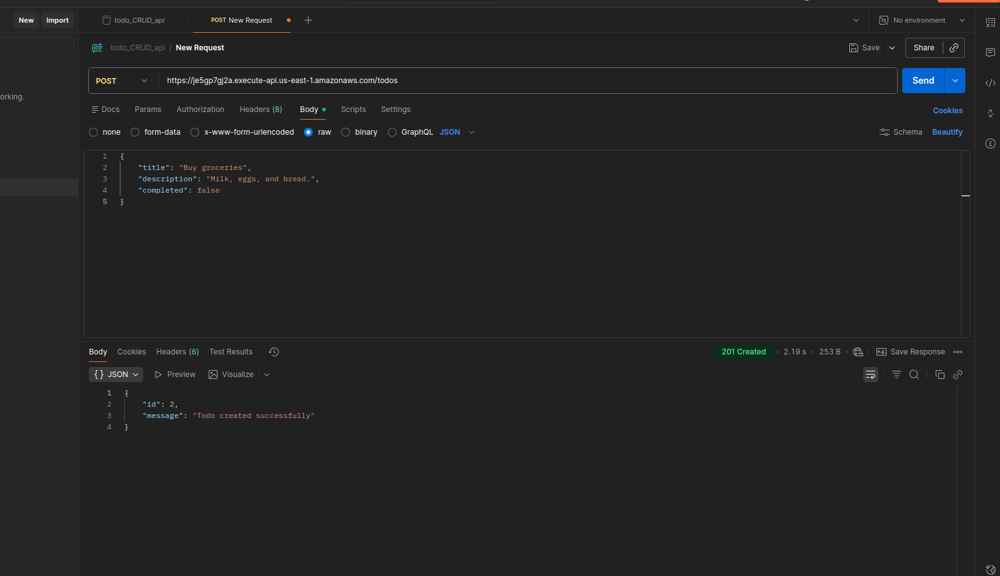
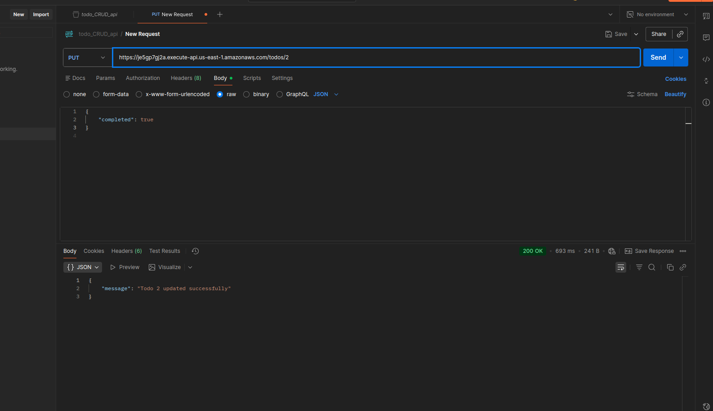
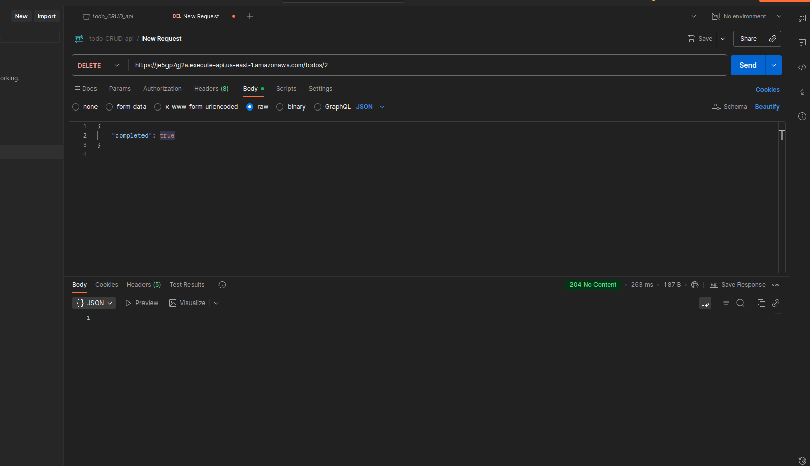

# Todo CRUD API Assessment

This repository contains a **Todo API** project implemented on **AWS**. All infrastructure resources are provisioned using **Terraform**, and the application is deployed using **AWS Lambda** and **API Gateway**. The database backend is a private **RDS** instance.

---

## Table of Contents

1. [Project Overview](#project-overview)  
2. [Repository Structure](#repository-structure)  
3. [Features](#features)  
4. [Setup and Deployment](#setup-and-deployment)  

---

## Project Overview

The **Todo API** allows users to create, read, update, and delete (CRUD) todo tasks. The API is fully serverless with **AWS Lambda** functions and **API Gateway** endpoints. All resources are defined using **Terraform**, making it easy to deploy in a repeatable and consistent way.

---

## Repository Structure

- **Terraform/** – Contains all Terraform configuration files to provision AWS resources.
  - `main.tf` – Main Terraform configuration for resources.  
  - `variables.tf` – Terraform variables.  
  - `outputs.tf` – Terraform outputs.  
  And all required resources .tf files  

- **Lambda/** – Contains Lambda function code for the Todo API.
  - `todo-api.py` – Main Lambda function implementation.  


---

## Features

- CRUD operations for Todo tasks.  
- AWS Lambda backend.  
- API Gateway fronted API.  
- Private RDS database.  
- secrets are stored in Environment variables  
- Infrastructure as Code using **Terraform**.

---

## Setup and Deployment

1. **Deploy Terraform resources:**

```bash
git clone https://github.com/jonathan-paule/Todo_assement_repo.git
cd Todo_assement_repo
cd Terraform
terraform init
terraform plan
terraform apply
```
2. **To ssh into the bastion use the below command**

```bash
chmod 400 todo_key_pair.pem 
ssh -i "todo_key_pair.pem" ec2-user@public-ip-of-bastion
  ssh -N -L 3306:<RDS_ENDPOINT>:3306 ec2-user@<BASTION_HOST_PUBLIC_IP> -i /path/to/your/key.pem
4:21
mysqlsh -u <RDS_USERNAME> -h 127.0.0.1 -P 3306
```tunnelling
3. **To connect to RDS using the below**
```bash
mysql -h <your-rds-endpoint> -P <port> -u <your-username> -p
then
use <database_name>
then execute this query to create a table
CREATE TABLE todos (
    id INT AUTO_INCREMENT PRIMARY KEY,
    title VARCHAR(255) NOT NULL,
    description TEXT,
    completed BOOLEAN DEFAULT FALSE,
    created_at TIMESTAMP DEFAULT CURRENT_TIMESTAMP
);

```
4. **testing CRUD api**
```bash
   using the api endpoint we can test CRUD api in postman or using local curl command. api endpoint and database endpoint will be taken from the terraform output.
       steps to test api in postman
         1. login to postman
         2. create a workspace
         3. create a new collection and give a name
         4. inside that collection create a request and give a name
         5. then paste the api gateway endpoint and select the method POST or GET or PUT or DELETE
         6. then click the send option
         7. now you can see the output.

```
5 **Destroying the resources**
```bash
terraform destroy
```
**dont forget to destroy the resources**

6. **Screenshots for testing api**
  
   **For POST Method**


   
   


   **For GET Method**


   

   
   **For PUT Method**


   


   **For DELETE Method**


   
   

